# The Joys of Colour, Technology and Light - Part 1: Story Behind the Artwork

Welcome to TechxArtisan, a creative technology studio based in Guangzhou! Back in January 2021, we found ourselves stepping deeper into the New Media Art scene, collaborating with artists who were doing some truly exciting work. These collaborations introduced us to technologies like machine learning, computer vision, and 3D printing—tech that was being explored in educational institutions across China.

It was still the first year of the pandemic, and many exhibitions were being cancelled. Despite the challenges, this unexpected downtime gave us a chance to experiment with new ideas, like LED control and object detection. But the real turning point came when I came across Dave Bramston’s work. 

Dave had been creating lighting artworks from waste plastic to promote a zero-waste lifestyle in Guangzhou, and I saw a few of his posts on WeChat (the most popular platform here in China). I was immediately hooked. I reached out, and our conversation on WeChat was the beginning of a truly rewarding collaboration.

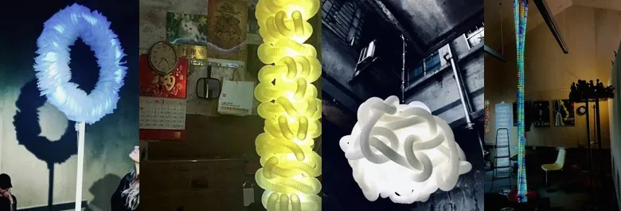{:style="max-height:400px"}

*Dave Bramston’s artworks.*

Before the pandemic, Dave was already well-known for his work—having delivered over 100 design workshops and creative lectures in China. His studio, Bramston Studio, focuses on fostering original thinking and creative inspiration. It was clear to me that this was the perfect person to team up with for a new project.

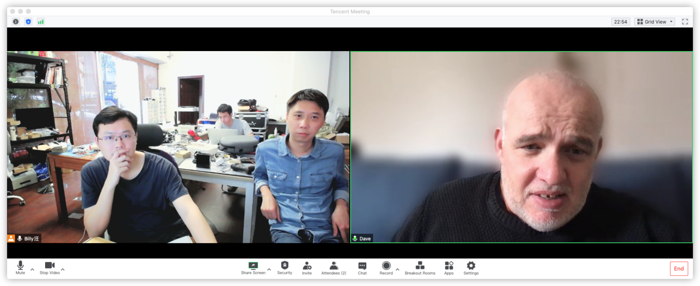{:style="max-height:400px"}

*One of several video meetings with Dave Bramston.*

Even though international travel was off the table, we didn’t let that stop us. Our teams met via video calls, and the brainstorming began. We were excited about how we could merge interactive technology with Dave’s artistic vision, and that’s how ‘Coloured Towers’ came to life. This piece was designed to detect the colours of people’s clothing and respond by changing the LED colours, creating a vibrant and interactive light display.

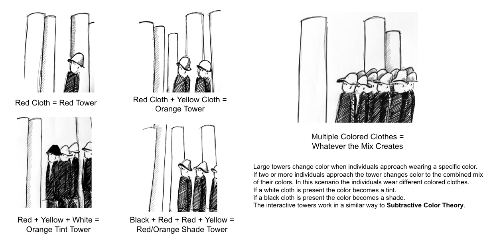{:style="max-height:400px"}

*The draft of the concept design.*

Originally, Dave wanted the towers to respond to people’s hats. But after some thought, I tweaked the algorithm to focus on detecting the colours of people’s clothing instead. Hats are a bit out of fashion these days—or maybe they’re still big in England? Perhaps in a *Downton Abbey* kind of way?

We soon began building the equipment in China, carefully designing and assembling the LED strips and controllers. After a bit of testing, we shipped everything off to the UK.

{:style="max-height:400px"}

*LED Controllers with our specially designed, UK-flag-shaped, 3D-printed cover case.*

With the tech side handled, Dave worked his magic with fabrics, transforming these electrical components into beautiful light-based artworks.

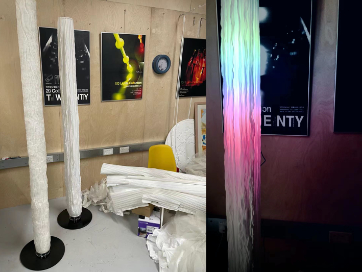{:style="max-height:400px"}

*Pictures of light stands in development.*

As the project evolved, Dave decided to scale it up for an exhibition he was curating at The Bowes Museum in the summer of 2022. Our studio couldn’t have been more thrilled! We envisioned these towering LED installations—each around 5 metres tall—lighting up the museum in stunning displays of colour.

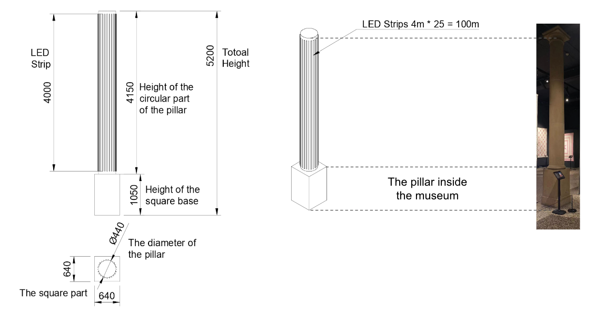{:style="max-height:400px"}

After a month of building and testing in China, we sent everything over to the UK in March 2022. Here’s a sneak peek of some final testing at our studio before shipment:

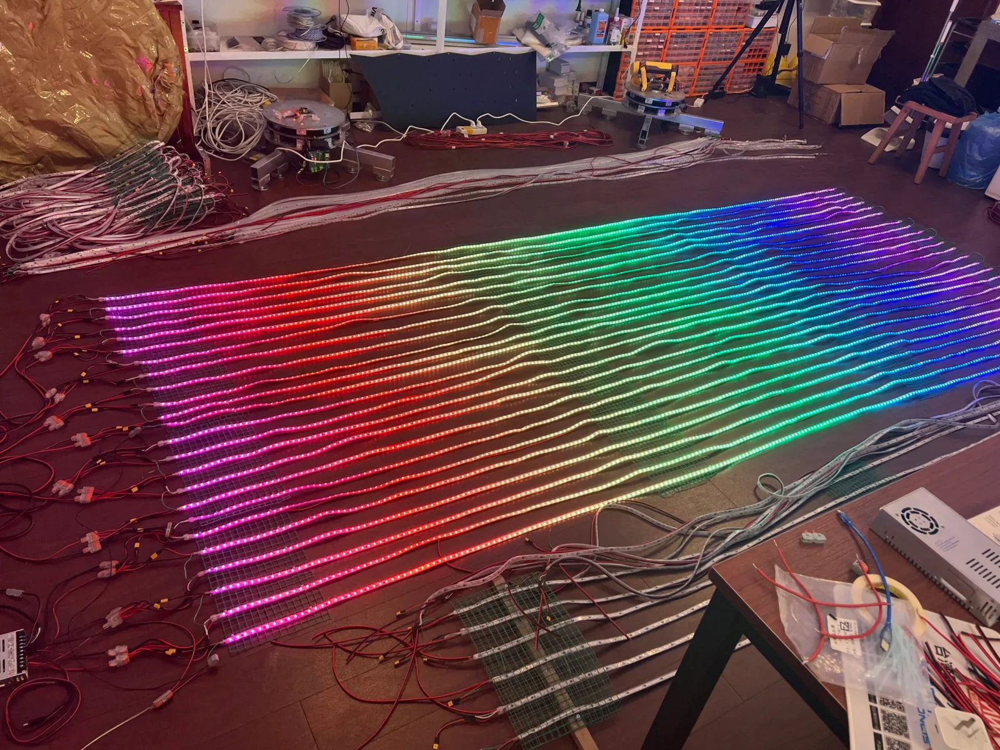{:style="max-height:300px"}
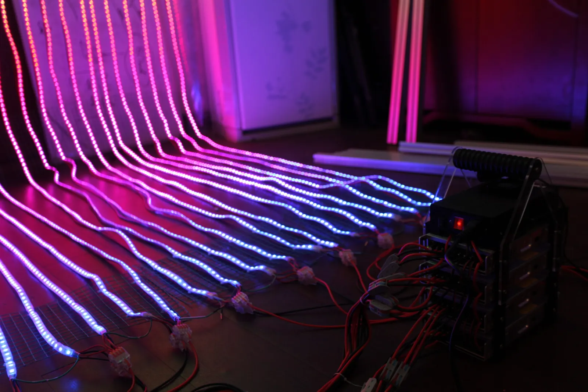{:style="max-height:300px"}

*A final test at TechxArtisan studio, China, before shipment to the UK.*

Once everything arrived safely in the UK, Dave and his team, along with the staff at The Bowes Museum, got to work installing the lights. Seeing the collaboration come to life from afar was such a fulfilling experience.

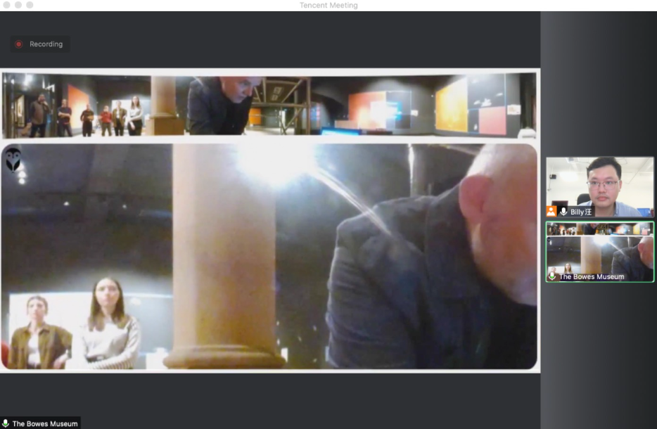{:style="max-width:600px"}

*Meeting with the Bramston Studio and Bowes Museum teams remotely to kick off the installation.*

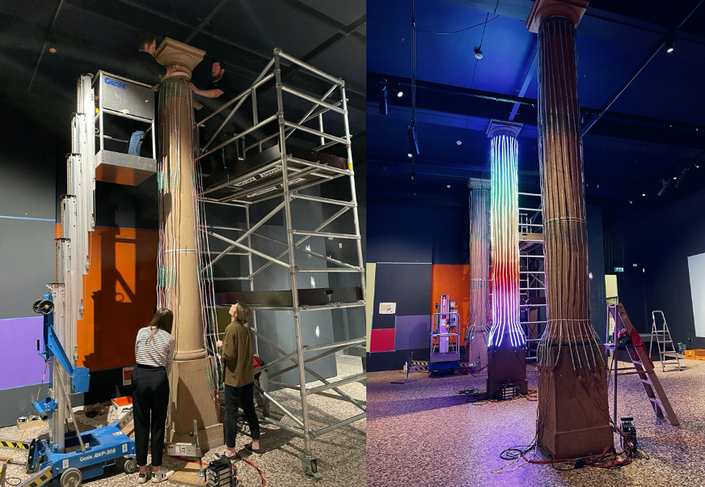{:style="max-width:600px"}

*The Museum team installing LED strips in the exhibition gallery.*

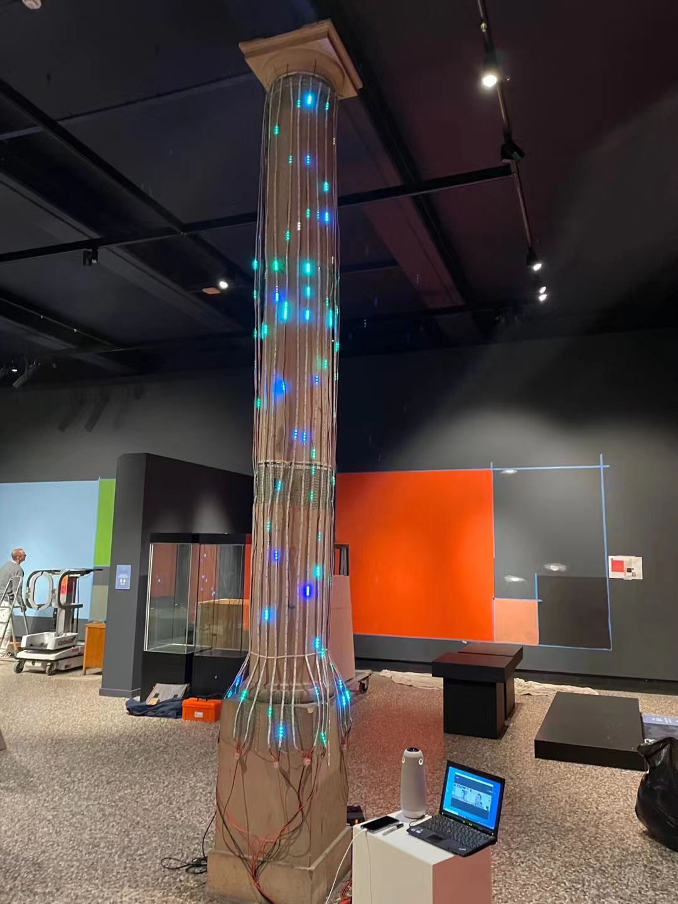{:style="max-width:600px"}

*Can you spot me in this picture?*

The exhibition, *Journey in Colour*, officially opened on 18 June and runs until 30 October. I must admit, my only real disappointment was not being able to attend the opening in person. However, seeing photos of visitors enjoying the final installation has been just as rewarding.

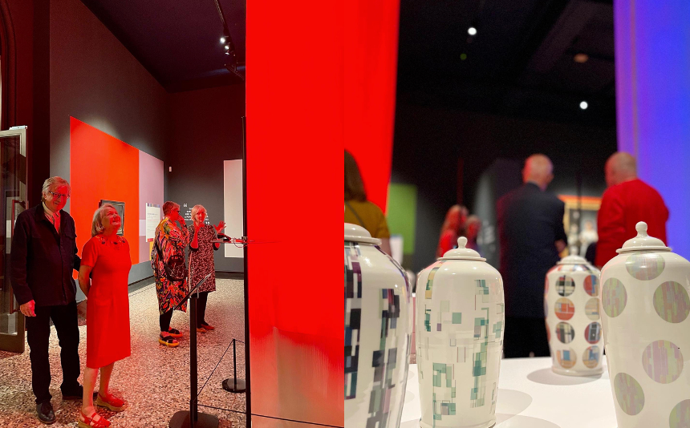{:style="max-width:600px"}
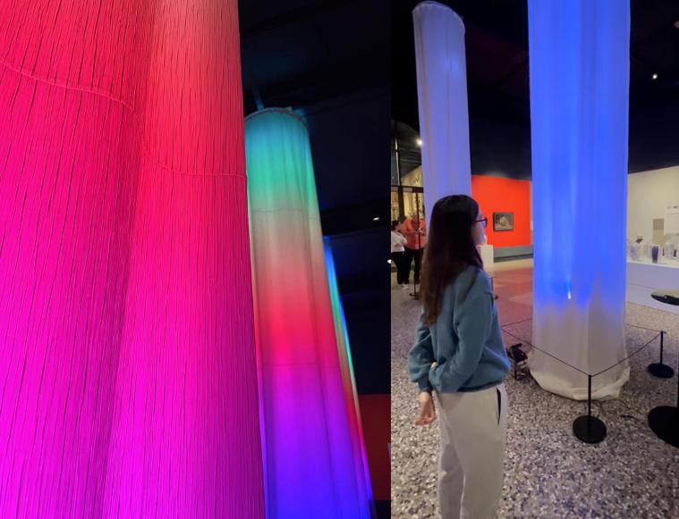{:style="max-width:600px"}

I’m immensely grateful to the photographer who captured these moments, and to Dave for inviting me to be part of this incredible collaboration. Although I haven’t met the Bramston Studio or Museum teams in person yet, I’m already looking forward to more creative projects together in the future—whether in China or the UK.

If you’d like to dive into the more technical aspects of this project, be sure to check out my next post:

[The Joys of Colour, Technology and Light – Part 2: Technical Challenges and Experiments](/blog/the-joys-of-colour-technology-and-light---part-2-technical-challenges-and-experiments/)