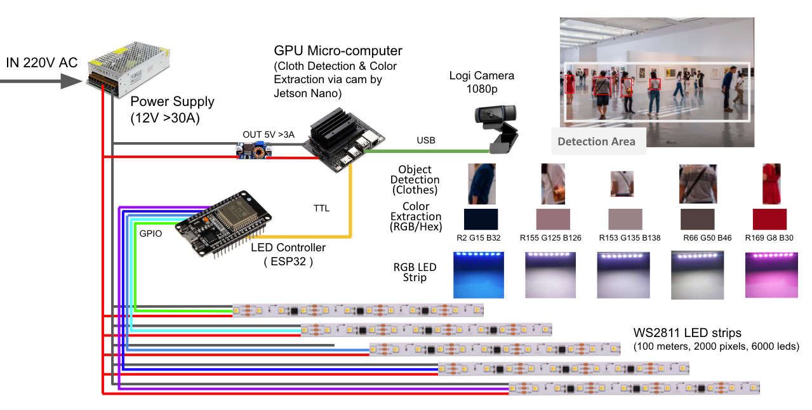
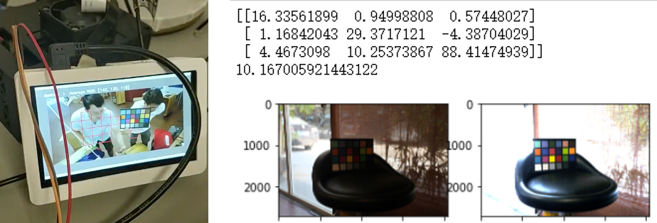
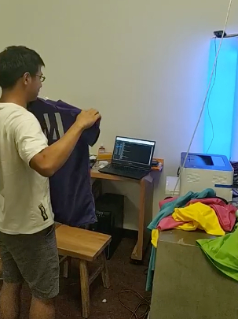
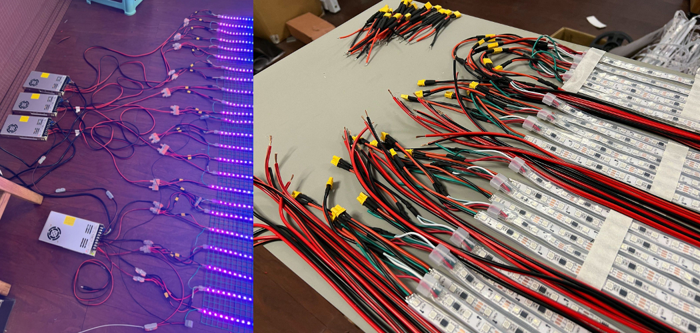

# The Joys of Colour, Technology and Light - Part 2: Technical Challenges and Experiments

In this post, we dive into the technical side of building the 4-metre-tall LED towers for British artist Dave Bramston. If you're curious about the creative backstory behind this collaboration and how we worked together to create the *Coloured Towers* during the pandemic for The Bowes Museum in the UK, check out [Part 1: Story Behind the Artwork](/blog/the-joys-of-colour-technology-and-light---part-1-story-behind-the-artwork/).

When it came to realising this art installation, there were several technical hurdles we needed to overcome at TechxArtisan. The essential hardware we used included Nvidia’s **Jetson Nano**—a low-power, GPU-backed microcomputer perfect for running AI algorithms—and the **ESP32**, a widely used microcontroller unit (MCU) that effectively manages communication between the host computer and LED light units using the [FastLED](https://fastled.io/) library.

Here’s a brief overview of the process:
1. **AI algorithms** on the Jetson Nano detect the clothes people are wearing via a camera.
2. **K-means clustering** is used to extract the dominant colour of their clothes.
3. The extracted RGB values are sent to the ESP32, which controls the LED strips attached to the artwork.



*The technical process.*

Now, let’s break down some of the most interesting technical challenges we encountered.


### Detecting Clothes with Nvidia Jetson Nano

The Jetson Nano allowed us to run open-source AI models trained to detect human clothing. The process involves capturing each image frame from a camera, dividing it into a matrix of 10x16 grids, and running a model to identify which grids match our target—clothes, in this case. Although the model is designed to detect a range of objects, including those on the **MHP Class list**, we specifically used it for clothes detection.


### Translating Colours Between Reality and Digital

Human vision perceives colour through reflected light, but machines “see” colours by capturing images and converting them into digital codes. Here’s where the tricky part comes in—cameras don’t always capture colours accurately due to factors like lighting, focus, white balance, and exposure settings. We aimed to bridge this gap and capture colours as close to reality as possible.



*Using a colour checker board to align digital colours with reality.*

Once the machine detects a colour, we apply k-means clustering to extract the dominant colour from the clothes. These RGB values are then averaged and sent to the LED controller.


### LED Colours and the RGB Problem

The LED light strips (ws281x series) we used can mix red, green, and blue (RGB) channels to create a wide range of colours. But there are some limitations:
- LED lights struggle to represent greys and blacks if a visitor’s clothes are dark. The LEDs simply reduce overall brightness.
- Our ws281x strips tend to skew slightly blue, which meant we had to fine-tune the colour balance in software to get the shades just right.



*Testing the stability of the colour detection programme.*

There’s also an interesting feedback loop in play: when the machine detects the colour of someone’s clothes, it projects a corresponding LED light colour, which in turn enhances the clothes' original hue. This creates a dynamic, iterative process that makes the interaction more fun, especially with multiple participants wearing different colours.


### Powering All Those LED Strips

Lighting up that many LED strips safely and efficiently was no small feat. Each of the four pillars required careful power calculations to ensure the system could handle the load without any issues. Here’s a quick breakdown:

For each pillar:
- **24 LED strips** × 4 metres per strip = **96 metres** of LEDs per pillar
- **96 metres** × 60 LEDs per metre = **5,760 LEDs**
- Each strip uses **4 amps** at full power (white light)
- So, **24 strips** × 4 amps = **96 amps** required for one pillar
- 96 amps × **12V** = **1,152W** per pillar

This adds up to around **4,600W** when all four pillars are powered at full intensity. However, most of the light animations we created consume significantly less power, since we rarely use full white light. Nevertheless, building in some redundancy ensures the system remains safe and stable.



*Carefully connecting the power supply.*

For the technically inclined, here's a snippet from our FastLED code:
```cpp
const uint8_t kMatrixWidth = 12;
const uint8_t kMatrixHeight = 80;
```
This allowed us to control **12 x 80 = 960 pixels** per pillar.


### Final Thoughts

For more in-depth technical insights, check out my post in the FastLED community on Reddit. I’d like to give a shout-out to **Quindor** and **Charles Goodwin** for their support and upvotes. Collaborating with Dave Bramston and The Bowes Museum has been an incredibly fulfilling experience, and we’re eager to continue pushing the boundaries of art and technology.

If you’re working on a similar project or are just curious about this type of installation, feel free to reach out—we’re always happy to share our knowledge and learn from others in the community.

Thanks for reading!