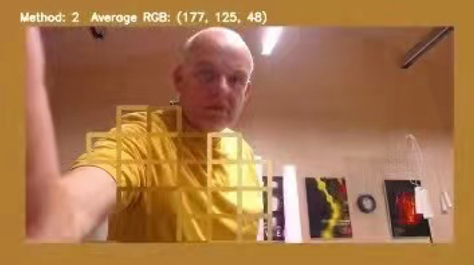

# The Joys of Colour, Technology and Light - Part 2: Technical Challenges and Experiments

This is a technical article how Techxartisan studio built 4-meters-tall LED towers for a British artist Dave Bramston. If you want to know more about the background of this artwork creation and collaboration between Techxartisan and Dave Bramston, and how they worked together on the project of Colored Towers for the Bowes Museum in the UK during the pandemic, please read this article:

[The Joys of Colour, Technology and Light – Part 1: Story Behind the Artwork](/blog/the-joys-of-colour-technology-and-light---part-1-story-behind-the-artwork/)

To build the structure for this art installation, there were several technical challenges for our studio to overcome.  The essential hardware we applied in our project is a micro, GPU-backed, low-power computer, [Nvidia’s Jetson Nano](https://developer.nvidia.com/embedded/jetson-nano-developer-kit). The LED controller to manage an elegant communication between a host computer and LED light units and to run lighting animations by open-source [FastLED](https://fastled.io/) library effectively is ESP32, a popular MCU control unit. 

The basic procedures here are: 
    1. run AI algorithms in the microcomputer to detect clothes people are wearing via a camera; 
    2. apply k-means to extract the dominant color from clothes;
    3. manipulate, blend and send RGB values to the LED controller, which controls LED strips attached to the artwork.

*How to achieve it technically?*

I don’t want to make this article too technical, but I would like to outline the challenges we encountered during the development of the works to realise the final art works. I have to say these are very interesting subjects to learn (for people like us, geeks, makers, electricians, engineers, developers, etc.).

How does Nvidia Jetson Nano detect humans’ clothes?
Jetson Nano allows us to apply an open-source AI algorithm and well-trained inference model for detecting human clothes in our project. The general procedure of detection by the machine is to grasp each image frame from a camera, to divide the frame into 10*16 matrix grids, to run the inference model to see whether these grids have a high confidence to fit into the feature of the pre-trained target object, in our case, clothes. Technically speaking, the model can detect any objects from this list of MHP Classes. It doesn’t have to be clothes.

Colours Travel Between Real and Digital World and RGB Problems
We humans can see the colours of things because of the light reflected from their surfaces and textures to our eyes. Machines “see” colours through a camera capturing frames from the real world which are transferred into the digital codes of colours. In this early step, the colours have already been mis-interpreted due to the condition of changing light environment, different parameters of focus, white balance and exposure of various cameras. This step is just a matter of capturing the colour data as close to the real world as possible and converting it into the machine world.

*Using a colour checker board, widely applied in the photography industry, to align digital colours with the real world as much as possible.*

Once the machine is able to capture colours from frames and detect human clothes, the program applies k-means, a statistical trick, to extract the dominant colour from image blocks of clothes. The next is to average out all the RGB colours from these blocks into one dominant colour for the whole image frame.

*Dave testing the program to capture the colour of his yellow shirt.*

The way LED light delivers different colours to the human eye is through manipulating brightness and blending 3 colour channels: red, green and blue lights (RGB). The next problem is that LED light cannot really present the colours of grey or black if someone wears dark clothes. It just lowers its overall brightness. Moreover, the RGB LED strips that we used were ws281x, a specific series of LED strips, which tend to be a bit bluish in general. The blue channel requires adjustment in software levels.

*My teammate testing the stability of the detection programme.*

The last interesting fact related to RGB light performance in this project is colour iteration. When the machine detects the colour of clothes in the real world, it responds and projects a LED light colour on the visitor’s clothes. This strengthens the original colour of the visitor’s clothes with its projected lighting colour. Then the combined colour is re-fed back to the machine that presents another stronger new colour on its LED lights, and so on. Such a colour iterative feature makes interaction more fun for multi-participants whose clothes are different colours.

Electronic Engineering: How to Light Up That Many LED Strips?
This project uses many LED strips to cover the four tall pillars. It requires much caution, careful calculation and tests of electricity before powering up all the LED strips. It is a matter of safety in the use of electricity and is critically important. After all, blowing things up is the last thing we want to do. The following is a rough calculation of electronic capability for you to understand the general electrical scale.

*Connecting the power supply requires great care*

For each pillar,

24 LED strips * 4 metres per strip = 96 metres

96m × 60 LEDs per metre = 5760 LEDs

Each strip can go up to 4 amps *

24 LED strips × 4 amps ≈ 96 amps for one set *

96 amps × 12V ≈ 1152W for one set *

* When all LEDs turn white (RGB channels all run in full power)

For one set, my setting in program is

const uint8_t kMatrixWidth = 12;

const uint8_t kMatrixHeight = 80;

Therefore, I can control 12*80 = 960 pixels

Powering up 4 pillars of LED strips at the same time in full power, requires up to 4600W power, at least in theory. The project itself, in fact, does not need to turn white when all RGB channels are in full power, for a long time. Moreover, most of the light animations and effects consume much less power than white in full power does. Yet its electricity is built in redundancy for safety.

For more technical details here’s my post in the FastLED community of Reddit. Finally, I want to thank Quindor and Charles Goodwin. Upvotes from the community are also great supporters of our work. We would be happy to share our knowledge and experience of creating these artworks in collaboration with Dave Bramston and The Bowes Museum and to learn about other similar artworks.  So, do get in touch.

Thanks!