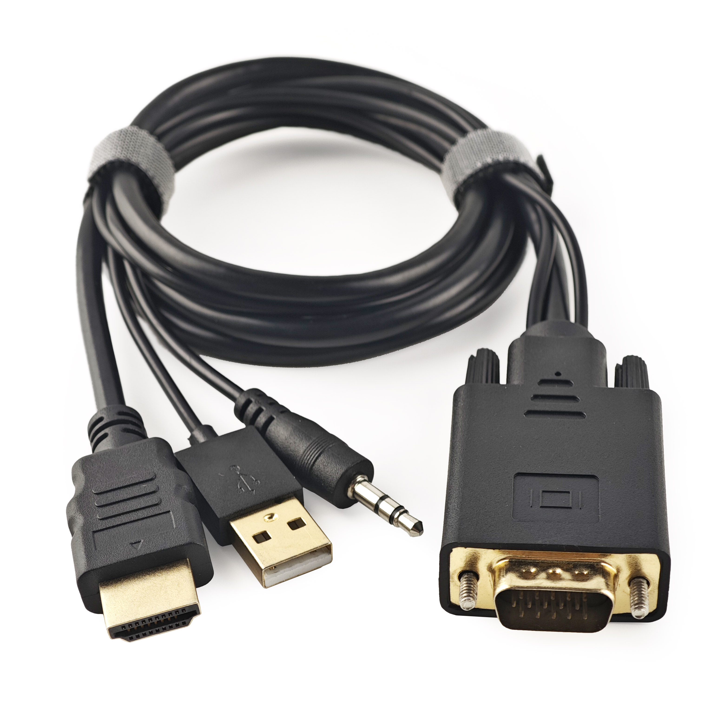

# Our Products

From handy cables and adapters to cool KVM solutions, we've got a variety of products to boost your tech game.

## Openterface Mini-KVM

{:style="height:360px"}

The Openterface Mini-KVM allows you to control a headless computer directly from your laptop or desktop using USB and HDMI connections, eliminating the need for additional peripherals or network connectivity.

- **Model**: OP-MINIKVM-BASIC / OP-MINIKVM-TOOLKIT
- **Device Dimensions**: 61 x 53 x 13.5 mm / 2.40 x 2.09 x 0.53 inches
- **Device Net Weight**: Approximately 48g
- **Casing Material**: Aluminum alloy, PLA
- **Max Video Input**: Up to 3840x2160@30Hz via HDMI
- **Max Video Output**: Up to 1920x1080@30Hz
- **Audio Capture**: HDMI embedded audio passthrough
- **Power Supply**: USB-C powered. No external power supply required.

### Use Case
For a detailed use case of this device, please visit [Streamlined Server Management](/use-cases/#streamlined-server-management).

### Demo Video
Watch the demo video by Tech influencer **Cameron Gray** on how to use this device: [This USB KVM Console is Awesome!](https://youtu.be/xAEQpWyfY-c?si=auB5NtqHVw2C7iIK&t=1693)

<button class="md-button" onclick="window.location.href='https://www.crowdsupply.com/techxartisan/openterface-mini-kvm#products'">Place Order</button>

## VGA to HDMI Converter Cable

{:style="height:360px"}

This product converts VGA video and integrates audio into HDMI, enabling easy connection of VGA devices to HDMI displays.

- **Model**: CABaLE100-VGA2HDMI
- **Length**: 1M
- **Output Video Resolution**: 1920x1080P Full HD
- **Input Audio**: 3.5mm audio jack
- **Audio Out**: via HDMI
- **Power Supply**: Powered via USB

<button class="md-button" onclick="window.location.href='https://www.crowdsupply.com/techxartisan/openterface-mini-kvm#products'">Place Order</button>

---

## Type-C to USB-A Cable with Adapter

{:style="height:360px"}

This versatile Type-C Male to USB-A Male cable, paired with a USB-A Female to USB-C Male adapter, offers flexible connectivity to target devices. It allows for data transfer and transmission of keyboard and mouse control signals, regardless of whether the target device uses a USB-A or Type-C port.

- **Length**: 0.3m
- **Colour**: Black
- **Adapter**: USB-A Female to USB-C Male
- **Use**: Facilitates easy control and data transfer to the target device.

---

## Type-C to Type-C Cable with Adapter

{:style="height:360px"}

This stylish and soft-feel Type-C Male-to-Male cable in vibrant orange is designed for host computer connections. It comes with a USB-C Female to USB-A Male adapter for enhanced compatibility, ensuring you can connect to host computers using either Type-C or USB-A ports. Additionally, this cable supports **240W fast charging** (Voltage DC50V, Current 5A, Power 240W), making it perfect not only for our Mini-KVMs but also for charging your mobile phone or laptop.

- **Length**: 1.5m
- **Colour**: Orange
- **Adapter**: USB-C Female to USB-A Male
- **Use**: For high-speed data transfer between the host computer and the Mini-KVM, and for fast charging mobile phones or laptops.

---

## HDMI Male-to-Male Cable

{:style="height:360px"}

This compact HDMI cable is perfect for connecting your target device to capture video output, ensuring seamless integration with your Openterface Mini-KVM.

- **Length**: 0.3m
- **Colour**: Black
- **Use**: Ideal for high-definition video transmission from the target device to the Mini-KVM.

---

## Openterface Toolkit Bag

{:style="height:360px"}

Keep your Openterface Mini-KVM and its accessories organised and portable with this compact toolkit bag. Featuring a stylish orange zipper and stretchy mesh pockets, this bag ensures excellent cable management and ease of transport, perfect for IT professionals on the go.

- **Dimensions**: 180 x 115 x 50mm
- **Colour**: Black with orange zipper
- **Use**: Ideal for storing and organising your Mini-KVM and its cables.

---

## More Coming Soon

Stay tuned for more products, designed to enhance your Tech experience.