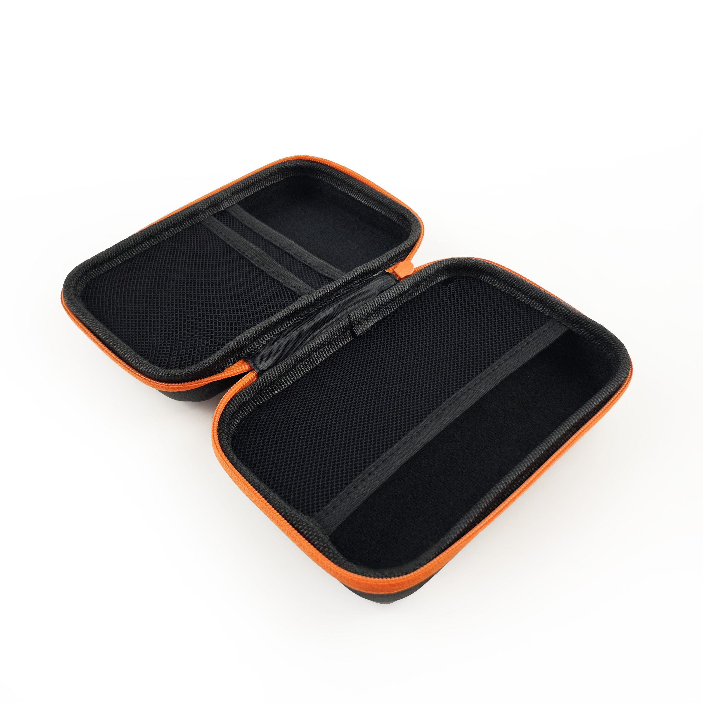

# Our Products

From handy cables and adapters to cool KVM solutions, we've got a variety of products to boost your tech game.

## Openterface Mini-KVM

{:style="height:360px"}

The Openterface Mini-KVM allows you to control a headless computer directly from your laptop or desktop using USB and HDMI connections, eliminating the need for additional peripherals or network connectivity.

- **Model**: OP-MINIKVM-BASIC / OP-MINIKVM-TOOLKIT
- **Device Dimensions**: 61 x 53 x 13.5 mm / 2.40 x 2.09 x 0.53 inches
- **Device Net Weight**: Approximately 48g
- **Casing Material**: Aluminum alloy, PLA
- **Max Video Input**: Up to 3840x2160@30Hz via HDMI
- **Max Video Output**: Up to 1920x1080@30Hz
- **Audio Capture**: HDMI embedded audio passthrough
- **Power Supply**: USB-C powered. No external power supply required.

### Use Case
For a detailed use case of this device, please visit [Streamlined Server Management](/use-cases/#streamlined-server-management).

### Demo Video
Watch the demo video by Tech influencer **Cameron Gray** on how to use this device: [This USB KVM Console is Awesome!](https://youtu.be/xAEQpWyfY-c?si=AkNVYHHYoRLn2-iB)

[Place Order](https://www.crowdsupply.com/techxartisan/openterface-mini-kvm#products){ .md-button }

- {:style="height:260px"}

    __VGA to HDMI Converter Cable__

    1m VGA to HDMI converter cable with integrated audio for easy connection of VGA devices to HDMI displays in 1080p Full HD. Powered via USB with 3.5mm audio input. 

    [:octicons-arrow-right-24: Place Order](https://www.crowdsupply.com/techxartisan/openterface-mini-kvm#products)

- {:style="height:260px"}

    __Type-C to Type-C Cable with Adapter__

    1.5m orange USB 2.0 cable for data transfer and 240W charging, featuring a soft, silicone-like material for a comfortable, high-quality feel. Includes a USB-C to USB-A adapter for compatibility.

    <!-- [:octicons-arrow-right-24: Learn More](/product/type-c-type-c) -->

- {:style="height:260px"}
    
    __Type-C to USB-A Cable with Adapter__

    0.3m black cable for fast data transfer, includes a USB-A to USB-C adapter for flexible device connectivity.

    <!-- [:octicons-arrow-right-24: Learn More](/product/type-c-usb-a) -->

- {:style="height:260px"}

    __HDMI Male-to-Male Cable__

    0.3m black cable for high-definition video transmission.

    <!-- [:octicons-arrow-right-24: Learn More](/product/hdmi-male-to-male) -->

- {:style="height:260px"}

    __Openterface Toolkit Bag__

    Compact toolkit bag with mesh pockets and an orange zipper, perfect for organising and carrying the Mini-KVM and accessories.

    <!-- [:octicons-arrow-right-24: Learn More](/product/toolkit-bag) -->

## More Coming Soon

Stay tuned for more products, designed to enhance your Tech experience.