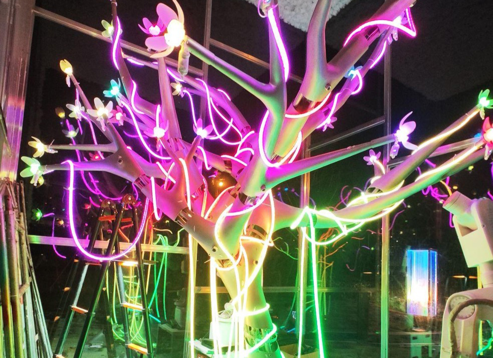
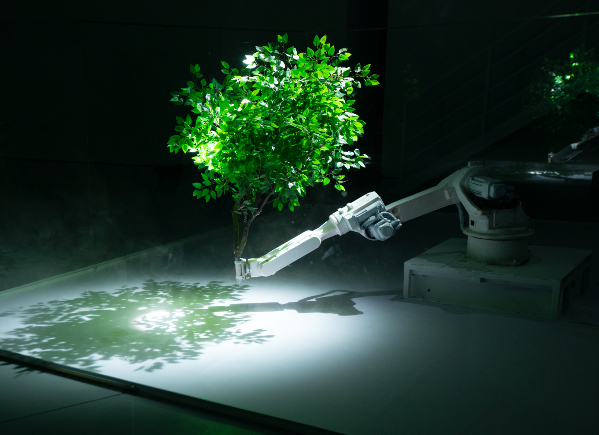
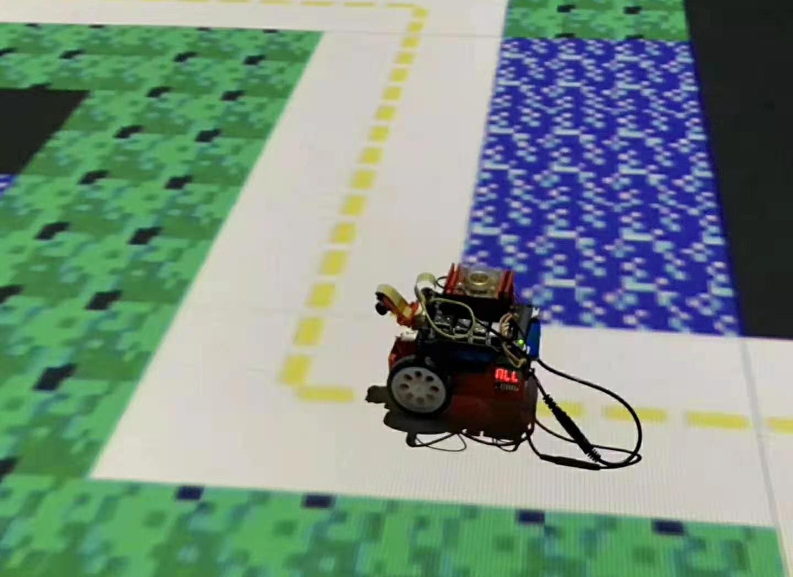
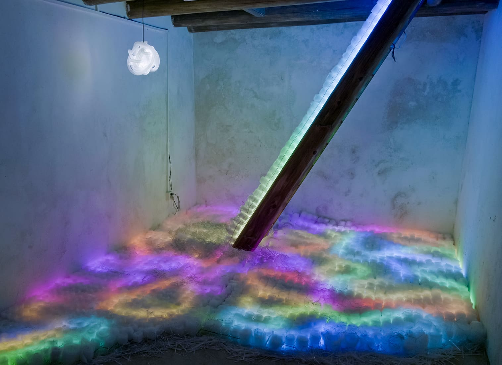
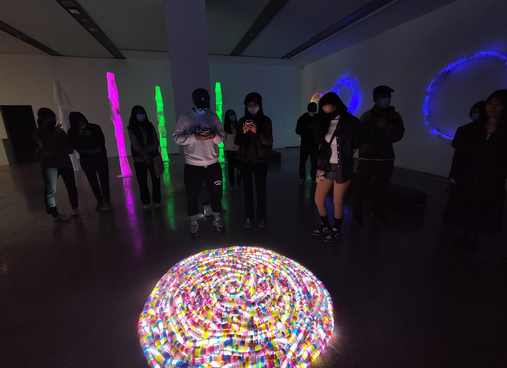
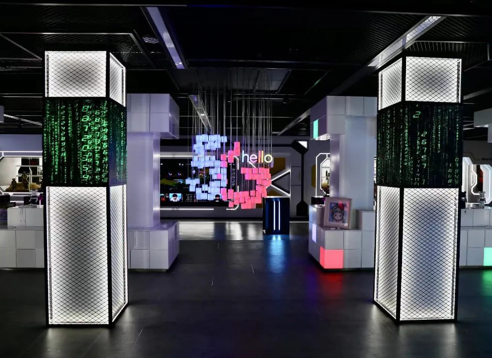
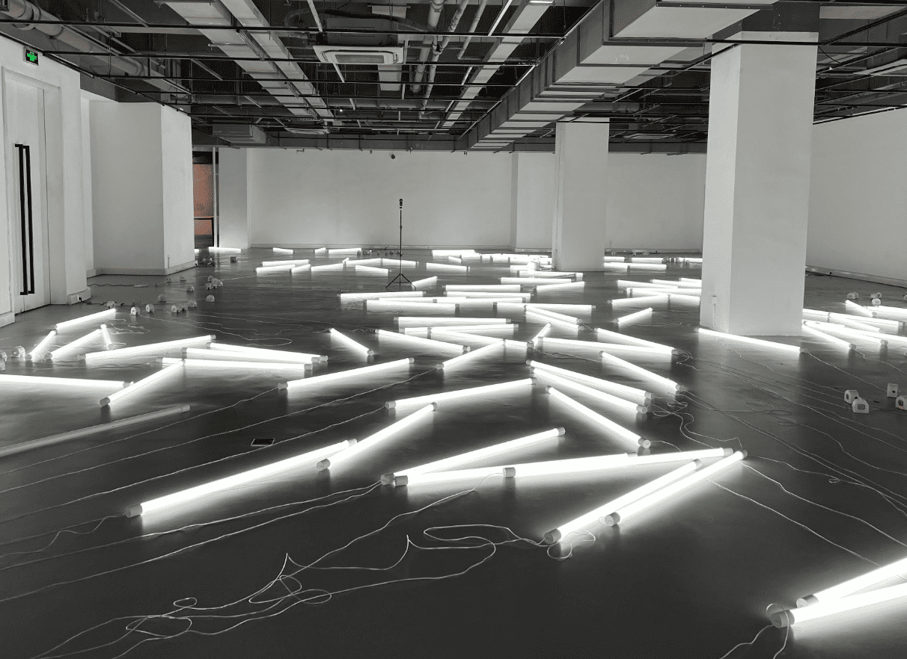
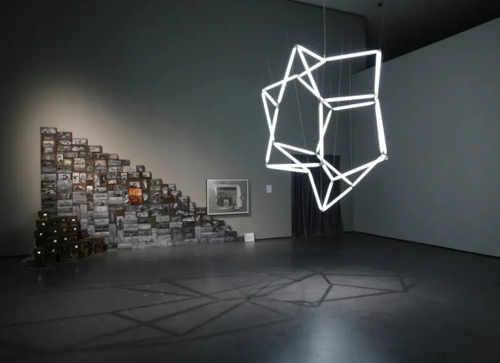

# The List of Projects

-   **DreamMech Forest**

    {:class="responsive-image"}

    DreamMech Forest is an outdoor art installation by TechxArtisan in Hefei. It features metal trees with mechanical flowers that open and close using N20 motors. RGB LED strips create vibrant lighting effects, and each flower connects to the main controller via WiFi for synchronized control. With 20 to 30 mechanical flowers, DreamMech Forest symbolizes the fusion of technology and art.

    [:octicons-arrow-right-24: Learn More](projects/dreammech-forest.md)

-   **The First Law of Forest**

    {:class="responsive-image"}

    The First Law of Forest is an intriguing art installation by Chen Baoyang that delves into the intricate relationship between humans, machines, and technology. Utilizing AI, a robot arm, smoke, and spotlights, this piece creates a mesmerizing visual experience. It challenges viewers to reconsider the possibilities of life in the digital age. Through the metaphor of a "mechanical tree," the installation breaks down mental barriers and unveils the "forest law."

    <!-- [:octicons-arrow-right-24: Learn More](projects/the-first-law-of-forest.md) -->

-   **Congrats X, the Y is in another Z**

    {:class="responsive-image"}

    Congrats X, the Y is in another Z is an innovative autonomous car art project, created in collaboration between TechxArtisan and artist Chen Baoyang from the CAFA. This project features an AI-driven car that navigates through a randomly generated maze, starting from an initial point and finding its way to the exit. Upon reaching the exit, the car designates it as the new starting point, and a new maze is generated, perpetuating this cycle.

    <!-- [:octicons-arrow-right-24: Learn More](projects/congrats-x.md) -->

-   **Coloured Towers**

    {:class="responsive-image"}

    The Coloured Towers project is an innovative art installation that merges technology and creativity to create a dynamic, interactive experience. Designed in collaboration with British artist Dave Bramston for his solo exhibition *The Joys of Colour*, this project uses AI and LED technology to respond to the colors of visitors' clothing, creating a vibrant light display.

    [:octicons-arrow-right-24: Learn More](projects/coloured-towers.md)

-   **Moon River**

    {:class="responsive-image"}

    Moon River is a light installation that beautifully reflects the fluidity of Hakka culture through light and form, utilizing methods of regeneration, repurposing, and recreating. This educational project was installed in ancient Hakka houses in Shenzhen, China, and was created in collaboration with British artist Dave Bramston and the Shenzhen SUStech School of Design.

    <!-- [:octicons-arrow-right-24: Learn More](projects/moon-rivier.md) -->

-   **Spectrum of Things**

    {:class="responsive-image"}

    Spectrum of Things is a captivating solo exhibition by British upcycling artist Dave Bramston. This exhibition features over seven collaborative artworks, utilizing factory leftovers from the Pearl River Delta. These materials, laden with limitations and challenges, are transformed through light installations and interactive techniques, giving rise to a spectrum of forms and colors.

    <!-- [:octicons-arrow-right-24: Learn More](projects/spectrum-of-things.md) -->

-   **Hello 5G Light**

    {:class="responsive-image"}

    Hello 5G Light is an anamorphic light installation composed of 91 LED tubes. From specific angles over 4 meters away, it displays the text "Hello 5G", while from other angles, it appears as a complex shape. This installation can also showcase colorful lighting effects based on preset or custom settings, creating festive atmospheres for different holidays.

    <!-- [:octicons-arrow-right-24: Learn More](projects/hello-5g-light.md) -->

-   **Relationship**

    {:class="responsive-image"}

    Relationship is an evocative art installation created in collaboration with Wang Yuyang. This piece features over 300 LED tubes emitting white light. Each tube is equipped with motors at both ends, enabling random, patterned movements. The interplay of lights—colliding and moving apart—creates a mesmerizing visual metaphor for the encounters and separations inherent in human relationships. It explores the dynamics of human connections through light and movement.

    <!-- [:octicons-arrow-right-24: Learn More](projects/relationship.md) -->

-   **Plato’s Cube**

    {:class="responsive-image"}

    Plato’s Cube is an art installation by Wang Yuyang that explores form and perception with our studio. It features a cube of 12 LED tubes emitting white light, connected by transparent joints. The structure can twist, stretch, and compress in any direction. Controlled by a program, it continuously changes shape, ensuring the audience never sees a consistent form. This polyhedron offers a mesmerizing and ever-changing visual experience.

    <!-- [:octicons-arrow-right-24: Learn More](projects/platos-cube.md) -->

