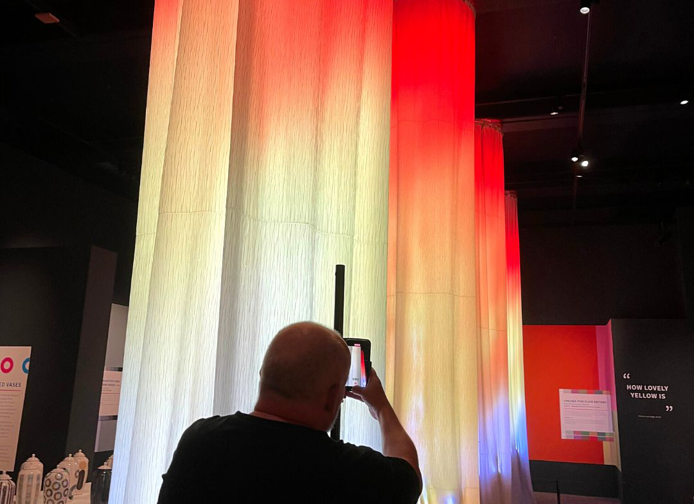

# Coloured Towers

{:style="height:360px"}

The Coloured Towers project is an innovative art installation that merges technology and creativity to create a dynamic, interactive experience. Designed in collaboration with British artist Dave Bramston for his solo exhibition [*The Joys of Colour*](https://thebowesmuseum.org.uk/exhibitions/journey-in-colour/), this project uses AI and LED technology to respond to the colors of visitors' clothing, creating a vibrant light display.

## Project Details

- **Artist**: [Dave Bramston](https://x.com/davidbramston)
- **Lead Engineer**: Billy Wang, TechxArtisan
- **Installation Height**: Approximately 5 meters
- **LED Count**: 5,760 LEDs per pillar, 4 pillars in total
- **Power Requirement**: Approximately 1,152W per pillar
- **Technology Used**: Nvidia Jetson Nano, ESP32, FastLED library
- **Exhibition**: The Bowes Museum, UK (18 June 2022 – 30 October 2022)

## Concept and Design

The concept of the Coloured Towers is to create an interactive light display that reacts to the colors of visitors' clothing. This is achieved through the use of AI algorithms running on the Nvidia Jetson Nano, which detect the dominant colors and translate them into LED light displays.

## Technical Challenges

- **Color Detection**: Using AI to accurately detect and translate colors from clothing to LED displays.
- **Power Management**: Ensuring safe and efficient power distribution for the extensive LED setup.
- **LED Calibration**: Fine-tuning the color balance to ensure accurate representation of detected colors.

## Exhibition

The Coloured Towers are part of Dave Bramston's solo exhibition at The Bowes Museum, showcasing the intersection of art and technology.

## Learn More

Check out [this short Youtube video](https://youtube.com/shorts/KyrteRpLcpw?si=O5ninQZw3rxvPdSp) to see how the colored tower is showcased at the museum.

And here's [a behind-the-scenes look](https://youtube.com/shorts/uxvQTEgr8fY?si=GQIRpC6GmXrZRzY7) at the LED setup before it was shipped to the UK.

For more details about the exhibition, head over to [The Bowes Museum's post](https://thebowesmuseum.org.uk/category/exhibitions/).